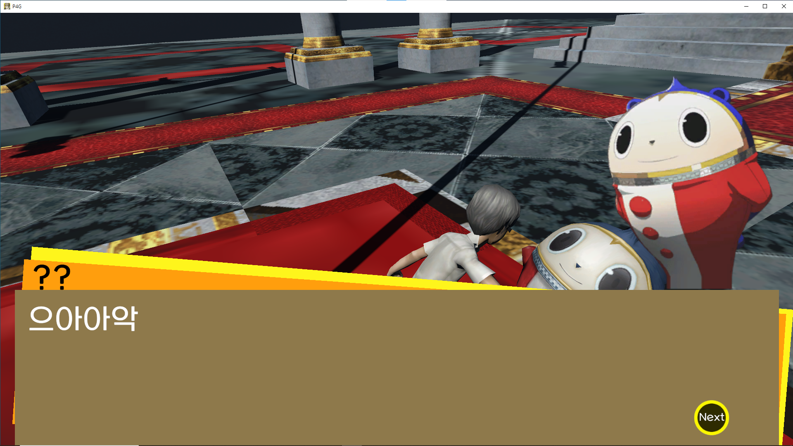

# P4G

Persona 4 Golden FanGame for Study


# Game Play

Main Game Scene


## CutScene and Dialogue





## In Dungeon and Battle


In Battle UI -> Attack , Skill etc..


Analysis allows you to determine the characteristics of enemies.


If you choose a skill, you will summon a persona and the persona will use the skill.


## Member Finding


Members help in battle together.


# Implement a turn-based game

used Command Pattern

see link below

https://github.com/dMinsz/P4G/blob/master/Assets/Scripts/Systems/Battle/BattleSystem.cs
https://github.com/dMinsz/P4G/tree/master/Assets/Scripts/Systems/Battle/Command

```cs
private void PlayerAttack()
    {
        GameManager.Data.Battle.commandQueue.Enqueue(new UICommand(uiHandler.MenuUI.transform, false));
        GameManager.Data.Battle.commandQueue.Enqueue(new UICommand(uiHandler.SelectMenuUI.transform, false));
        GameManager.Data.Battle.commandQueue.Enqueue(new UICommand(uiHandler.partyUI.transform, false));

        nowPlayer.Attack(nowShadow.attackPoint.position, nowShadow.transform.position, uiHandler.BattleUI.transform, cam);

        GameManager.Data.Battle.commandQueue.Enqueue(new FuncCommand(NextPlayer));
    }
```

BattleSystem Used Command Queue

https://github.com/dMinsz/P4G/blob/master/Assets/Scripts/Systems/Battle/BattleSystem.cs

```cs
    public Command activeCommand;
    public Queue<Command> commandQueue;
    //..
    //skip
    //..
private void Update()
    {
        if (commandQueue != null && commandQueue.Count > 0)
        {
            if (activeCommand == null || !activeCommand.isExecuting)
            {
                activeCommand = commandQueue.Dequeue();
                activeCommand.Execute();
            }
        }
    }
```


